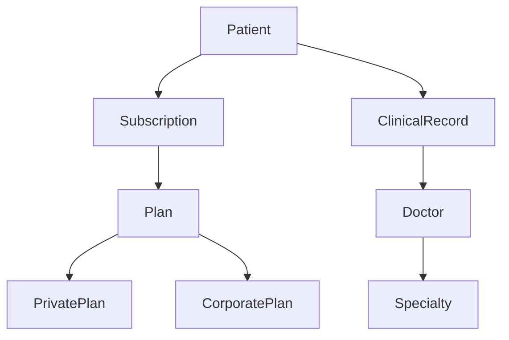

# SIAME - Sistema de Gestión para Clínicas de Salud

<p align="center">
  
  
  
  
  
</p>

## 🎥 Demo del Bot

<p align="center">
  
</p>

## 📋 Descripción del Proyecto

SIAME es un sistema integral de gestión para clínicas de salud que combina una API REST robusta con un bot de WhatsApp inteligente. El sistema permite gestionar pacientes, planes de salud, suscripciones, registros clínicos y facilita la comunicación automatizada con los usuarios a través de WhatsApp.

### 🎯 Características Principales

- **🤖 Bot de WhatsApp**: Comunicación automatizada con pacientes para emergencias, telemedicina, atención domiciliaria y consultas médicas
- **👥 Gestión de Pacientes**: Información completa de pacientes incluyendo datos médicos y de contacto
- **🏥 Planes de Salud**: Soporte para planes privados y corporativos con diferentes coberturas
- **📊 Registros Clínicos**: Seguimiento detallado de consultas médicas y tratamientos
- **💳 Sistema de Suscripciones**: Gestión de pagos y renovaciones automáticas
- **👨‍⚕️ Gestión de Médicos**: Directorio de doctores por especialidades
- **📱 API REST**: Endpoints completos para integración con otros sistemas

## 🏗️ Arquitectura del Sistema

### Entidades Principales



### Módulos del Sistema

- **Bot**: Manejo de conversaciones de WhatsApp con máquina de estados
- **Patients**: Gestión completa de información de pacientes
- **Plans**: Administración de planes de salud (privados y corporativos)
- **Subscriptions**: Control de suscripciones y pagos
- **Clinical Records**: Registros médicos y tratamientos
- **Doctors**: Directorio médico con especialidades
- **Specialties**: Catálogo de especialidades médicas

## 🚀 Tecnologías Utilizadas

- **Framework**: [NestJS](https://nestjs.com/) - Framework Node.js progresivo
- **Lenguaje**: TypeScript
- **Base de Datos**: PostgreSQL con TypeORM
- **Cache**: Redis con IORedis
- **Mensajería**: Twilio para WhatsApp
- **Validación**: Class Validator y Class Transformer
- **Configuración**: NestJS Config con Zod
- **Logging**: Pino (desarrollo) y Pino-Pretty (producción)

## 📦 Instalación

```bash
# Instalar dependencias
$ npm install

# Configurar variables de entorno
$ cp .env.example .env

# Ejecutar migraciones (desarrollo)
$ npm run start:dev
```

## ⚙️ Configuración

### Variables de Entorno Requeridas

```env
# Base de Datos
DB_HOST=localhost
DB_PORT=5432
DB_USERNAME=your_username
DB_PASSWORD=your_password
DB_NAME=siame_db

# Redis
REDIS_HOST=localhost
REDIS_PORT=6379

# Twilio
TWILIO_ACCOUNT_SID=your_account_sid
TWILIO_AUTH_TOKEN=your_auth_token
TWILIO_PHONE_NUMBER=your_phone_number
```

## 🏃‍♂️ Ejecución

```bash
# desarrollo
$ npm run start:dev

# producción
$ npm run start:prod

# con watch mode
$ npm run start:debug
```

## 🧪 Pruebas

```bash
# unit tests
$ npm run test

# e2e tests
$ npm run test:e2e

# test coverage
$ npm run test:cov
```

## 📡 API Endpoints

### Pacientes

- `GET /patients` - Listar pacientes
- `POST /patients` - Crear paciente
- `GET /patients/:id` - Obtener paciente
- `PATCH /patients/:id` - Actualizar paciente
- `DELETE /patients/:id` - Eliminar paciente

### Planes

- `GET /plans` - Listar planes
- `POST /plans` - Crear plan
- `GET /plans/:id` - Obtener plan
- `PATCH /plans/:id` - Actualizar plan
- `DELETE /plans/:id` - Eliminar plan

### Suscripciones

- `GET /subscriptions` - Listar suscripciones
- `POST /subscriptions` - Crear suscripción
- `GET /subscriptions/:id` - Obtener suscripción
- `PATCH /subscriptions/:id` - Actualizar suscripción
- `DELETE /subscriptions/:id` - Eliminar suscripción

### Registros Clínicos

- `GET /clinical-records` - Listar registros
- `POST /clinical-records` - Crear registro
- `GET /clinical-records/:id` - Obtener registro
- `PATCH /clinical-records/:id` - Actualizar registro
- `DELETE /clinical-records/:id` - Eliminar registro

### Doctores

- `GET /doctors` - Listar doctores
- `POST /doctors` - Crear doctor
- `GET /doctors/:id` - Obtener doctor
- `PATCH /doctors/:id` - Actualizar doctor
- `DELETE /doctors/:id` - Eliminar doctor

### Especialidades

- `GET /specialties` - Listar especialidades
- `POST /specialties` - Crear especialidad
- `GET /specialties/:id` - Obtener especialidad
- `PATCH /specialties/:id` - Actualizar especialidad
- `DELETE /specialties/:id` - Eliminar especialidad

## 🤖 Funcionalidades del Bot de WhatsApp

### Flujos Disponibles

1. **Atención Inmediata**: Ubicación en tiempo real para emergencias
2. **Telemedicina**: Consulta médica remota con validación de CI
3. **Atención Domiciliaria**: Servicio a domicilio con cálculo de costos
4. **Consultas Médicas**: Agendamiento de citas por especialidad
5. **Farmacia**: Contacto directo con farmacia

### Comandos Globales

- `menu` - Volver al menú principal
- `ayuda` - Mostrar ayuda

## 🗄️ Modelo de Datos

### Patient (Paciente)

- Información personal completa
- Datos de contacto de emergencia
- Información médica básica (tipo de sangre, alergias, condiciones)
- Estado del paciente

### Plan (Plan de Salud)

- Planes privados y corporativos
- Información de costos y coberturas
- Fechas de vigencia
- Detalles de beneficios

### Subscription (Suscripción)

- Vinculación paciente-plan
- Información de pagos
- Fechas de vigencia
- Renovación automática

### ClinicalRecord (Registro Clínico)

- Historial médico detallado
- Signos vitales
- Tratamientos y medicamentos
- Resultados de laboratorio

### Doctor (Médico)

- Información profesional
- Especialidad médica
- Horarios de consulta
- Tarifas de consulta

### Specialty (Especialidad)

- Catálogo de especialidades médicas
- Descripción de cada especialidad

## 🔐 Seguridad

- Validación de entrada con class-validator
- Sanitización de datos
- Control de acceso por roles (planeado)
- Encriptación de datos sensibles

## 📈 Monitoreo y Logging

- Logging estructurado con Pino
- Métricas de rendimiento
- Seguimiento de errores
- Logs de auditoría

## 🚀 Despliegue

### Docker

```bash
# Construir imagen
$ docker build -t siame-app .

# Ejecutar con docker-compose
$ docker-compose up -d
```

### Producción

```bash
# Compilar aplicación
$ npm run build

# Ejecutar en producción
$ npm run start:prod
```

---

<p align="center">
  Desarrollado con ❤️ para mejorar la atención médica en Venezuela
</p>
